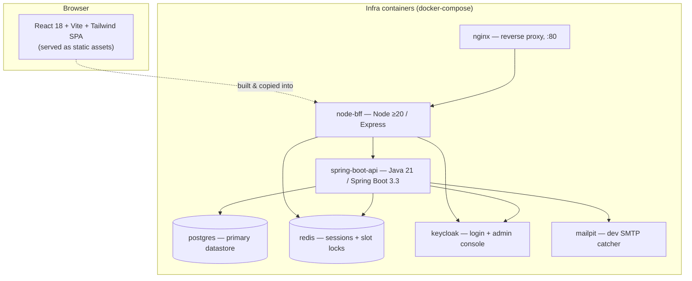
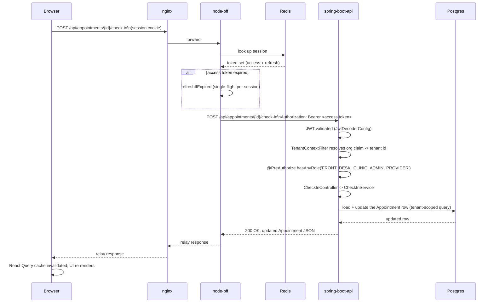

# Component Architecture

This document goes one level more concrete than `system-design.md`: the actual deployable
pieces, their internal shape, and how a request moves through all of them.

## 1. The deployable components

- **`spring-boot-api/`** — the one source of business logic and the only thing that talks to
  Postgres. Stateless; validates bearer JWTs; `ddl-auto: validate` (Flyway owns the schema).
- **`node-bff/`** — the only thing the browser talks to. Owns OIDC/PKCE auth, the session, and
  proxies `/api/**` to `spring-boot-api`.
- **`node-bff/frontend/`** — a separate React/Vite/Tailwind project (its own `package.json`,
  **not** an npm workspace of `node-bff`), nested under `node-bff/` specifically so the Dockerfile
  can build it in one stage and copy `dist/` into `node-bff`'s own `public/` for its runtime stage
  to serve.
- **nginx** — a single local-dev entry point on `:80`, pure pass-through reverse proxy with no
  logic of its own.
- **postgres / redis / keycloak / mailpit** — shared infra; see `deployment-guide.md` for how
  they're wired together locally.

## 2. `node-bff` internals

| File | Responsibility |
|---|---|
| `src/index.js` | App entry: serves `public/` (the built SPA), mounts `/health`, `/auth/*`, `/api/*`, falls back to `public/index.html` for any other GET (SPA client-side routing). |
| `src/auth/oidc.js` | OIDC discovery + client setup against Keycloak. Rewrites `authorization_endpoint`/`end_session_endpoint`/`issuer` from the internal (container-to-container) Keycloak URL to the browser-reachable public one before handing anything to the browser or validating a token — see the file's own header comment for the full reasoning (a real bug, found and fixed, about which host Keycloak stamps into the `iss` claim). |
| `src/auth/session.js` | Redis-backed (`connect-redis`) server-side sessions — never in-memory, so the BFF can restart or scale without logging everyone out. |
| `src/routes/auth.js` | The OAuth2 Authorization Code + PKCE (S256) login/callback/logout flow. |
| `src/routes/api.js` | The `/api/**` proxy. `PUBLIC_ROUTES` is an explicit allow-list of (method, path) pairs mounted *ahead of* the session gate, for endpoints that must work pre-login (clinic directory, slot availability, appointment/lab-order tracking by reference, guest booking). Everything else goes through `requireSession` → `refreshIfExpired` → `forwardToApi`. |
| `refreshIfExpired` (`api.js`) | Refreshes an expired access token before forwarding. Single-flight **per session**: concurrent requests sharing a session coalesce onto one in-flight Keycloak refresh call instead of racing it (a real bug — a page firing a dozen parallel queries right as the token expired would otherwise have `invalid_grant`'d most of them, since Keycloak rotates refresh tokens on use). |
| `forwardToApi` (`api.js`) | Attaches the session's Bearer token, forwards the request body (JSON-re-serialized for a normal request, raw-stream passthrough for a multipart file upload — JSON-re-serializing would silently drop file bytes), and relays the upstream response back untouched (content-type-agnostic, so a PDF or binary signature image passes through unmodified). |

The browser's session cookie is the *only* credential it ever holds. No access or refresh token
is ever sent to, or stored in, the browser.

## 3. `spring-boot-api` package structure

Every package lives under `com.clinicops.*`. Most follow the same internal shape: an `Entity`,
a `*Repository` (Spring Data JPA), a `*Controller`, and request/response records — a dedicated
`*Service` bean exists only where there's real cross-cutting logic, a contended resource needing
lock/transaction coordination, or a multi-step external call (Keycloak admin API, a payment
gateway) — not for plain single-row CRUD, which a controller does directly against a repository.

| Package | Purpose |
|---|---|
| `tenant` | `TenantContext` + `TenantContextFilter` — the one multi-tenancy enforcement point (see `system-design.md` §3). |
| `config` | `SecurityConfig` (method security, `@PreAuthorize` wiring, public-path allowlist), `JwtDecoderConfig` (the internal-JWKS-fetch vs. public-issuer-claim split — see its own class comment). |
| `common` | `BaseTenantEntity` — the base class every tenant-scoped entity extends. |
| `clinic` | The `clinics` table itself — directory lookup, the entity every tenant-scoped row ultimately points back to. |
| `clinicsettings` | Per-clinic overrides of platform defaults (tax rate, fee/notice-hour policy, timezone) and branding (logo/colors/display name), merged through one `ClinicSettingsService.resolve(...)` seam. |
| `platform` | Platform-admin clinic onboarding — Keycloak Organization creation via `RestClient`, local `clinics` row, optional initial `clinic_admin` login provisioning. |
| `user` | `AppUser` — the local mirror of a Keycloak identity, provisioned on first login. |
| `provider` / `room` / `appointmenttype` / `feepolicy` / `labrate` | clinic-admin-managed configuration entities (providers + their working hours, rooms, appointment types, tiered cancellation/no-show fee policies, lab test rate cards). |
| `scheduling` | Lazy, idempotent appointment-slot generation (`SlotGenerator`/`SlotGenerationService`) and the public availability endpoint. |
| `appointment` | The booking/check-in/cancel/reschedule/recurring-series core — `SlotLockService` (Redis lock) fronting the split-bean `AppointmentWriter`, the check-in state machine, `NoShowScheduler`. |
| `patient` | Patient records, front-desk search, portal auto-provisioning on first booking. |
| `encounter` | Clinical documentation — chief complaint/assessment/plan, ICD-10, the 9-system physical-exam checklist, prescriptions, sign-and-lock, post-sign addenda. |
| `vitals` / `allergy` / `medicalhistory` / `immunization` / `consent` | The smaller EHR-adjacent entities — each a focused, mostly-independent slice (see `system-design.md` §5 phase list for when/why each was added). |
| `referral` | Internal (provider-to-provider) and external referrals, one entity. |
| `laborder` | The full lab-order lifecycle, patient-request→staff-confirm two-phase flow, public tracking. |
| `payment` / `invoice` / `paymentgateway` | Shared billing primitives spanning appointments, lab orders, and (later) pharmacy dispenses — `Payment`/`Refund`/`Invoice` each have a nullable FK to every owner type with an exactly-one-owner DB check; `paymentgateway` is the pluggable (currently mock-only) charge/refund abstraction. |
| `notification` | The outbox pattern — a `Notification` row per event, `NotificationWorker` dispatches it, `SmtpEmailSender` delivers real email per-type payloads. |
| `phiaudit` | Staff-initiated PHI access logging, explicit call sites (not AOP). |
| `visitsummary` | The on-demand visit/encounter summary PDF — this app's first patient-facing document download. |
| `pharmacy` | The largest single module: medication catalog, batch-tracked stock, dispensing, drug-interaction checks, controlled-substance dual-sign-off, patient refill requests. |
| `inventory` | The *general* stock module (clinical supplies/PPE/office supplies, separate from pharmacy) plus equipment/asset tracking — items, suppliers, purchase orders, stock adjustments. |
| `accounting` | Chart of accounts + a real double-entry journal, auto-posted whenever a `Payment`/`Refund` happens. |
| `finance` | Budgets, minimal payroll, P&L/budget-vs-actual reporting — built on top of `accounting`'s own ledger. |
| `analytics` | Read-only aggregation endpoints (clinic-wide, pharmacy, inventory) backing each role's own dashboard charts. |
| `filestorage` | Local-disk file storage (provider signature images, etc.) — see `deployment-guide.md` for the Docker volume it needs. |

## 4. Frontend component layer

`node-bff/frontend/src/`:

| Layer | What's there |
|---|---|
| `components/` (shared primitives) | `DataTable` (the one searchable/sortable table every list page uses — client-side search via `searchAccessors`, column sort, an optional `renderExpanded` row panel), `Field`/`Button`/`Card`/`PageContainer`/`PageHeader`/`StatusPill`/`TabGroup`/`StatCard` (the design-system layer every page composes from), `ErrorBanner`/`EmptyState`/`Skeleton` (the three states every data-fetching page handles), `IconMenu` (the dropdown mechanism behind the language/theme/timezone/user menus), plus larger shared panels used across multiple pages (`PatientChart`, `PaymentsPanel`, `InvoicePanel`, `VisitSummaryLink`). |
| `components/analytics/` | The Recharts-based chart components (`ChartCard`, `ChartTooltip`, a validated `chartPalette.js`, and one component per chart type) shared by the clinic-admin and pharmacist dashboards. |
| `layout/` | `AppShell` (the logged-in shell: `Sidebar` + `Topbar` + routed content), `PublicShell` (logged-out top-bar-only shell), `Sidebar` (role-aware, collapsible, foldable groups), `Topbar` (hamburger/collapse toggle + language/theme/timezone/user menus). |
| `theme/` | `BrandingProvider` (per-clinic logo/colors), `ThemeProvider` (Light/Dark/System), `LanguageProvider` (English/Amharic via i18next), `TimezoneProvider` (browser/clinic/manual display preference). |
| `pages/` | One subdirectory per role (`patient/`, `front-desk/`, `provider/`, `clinic-admin/`, `pharmacist/`, `accountant/`, `platform-admin/`), plus shared cross-role pages (`booking/`, `lab-orders/`, `referrals/`, `inventory/`) reached by more than one role's own routes. |
| `api/queries.js` | The frontend's **one** data-fetching layer — every page uses a React Query hook from this file (`useXyz`/`useCreateXyz`/etc.), never a bare `fetch` call or a separate state-management store. |
| `api/client.js` | The thin `fetch` wrapper (`apiGet`/`apiPost`/`apiPostForm`) `queries.js` itself is built on — `credentials: 'include'` so the session cookie always rides along, `ApiError` for structured error handling. |
| `i18n/locales/{en,am}.json` | The full translation table — kept at exact key parity between both languages (checked by a flatten-and-diff script after every change). |

## 5. Request-flow walkthrough: front-desk checks a patient in

Every staff-facing write follows this same shape: session → Bearer attach → `TenantContextFilter`
→ `@PreAuthorize` → controller → (service, if the operation is more than plain CRUD) → repository
→ Postgres. A public endpoint (clinic directory, slot availability) skips the session/Bearer steps
entirely via `node-bff`'s `PUBLIC_ROUTES` and Spring Security's own `permitAll()` list, but still
passes through `spring-boot-api` for the actual query.

## 6. How the pieces are tied together

- **Frontend state**: React Query (`api/queries.js`) is the only data layer. There is no Redux,
  no Context-based global store for server data — a page's own `useState` covers transient form
  state, React Query's cache covers everything that came from the API.
- **Backend persistence**: Spring Data JPA repositories are the only persistence layer — no raw
  JDBC, no a second ORM. A handful of read-heavy projections use a native `@Query` (e.g.
  `AppointmentWithSlotView`, `PrescriptionDispenseView`) rather than forcing a JPA relation where
  none naturally exists, but they still go through the same repository interface shape.
- **Cross-service coupling stays minimal.** `node-bff` knows nothing about `spring-boot-api`'s
  internal structure — it's a pure Bearer-forwarding proxy. `spring-boot-api` knows nothing about
  the frontend at all. The only shared "contract" is the REST API surface itself (see
  `api-reference.md`).
