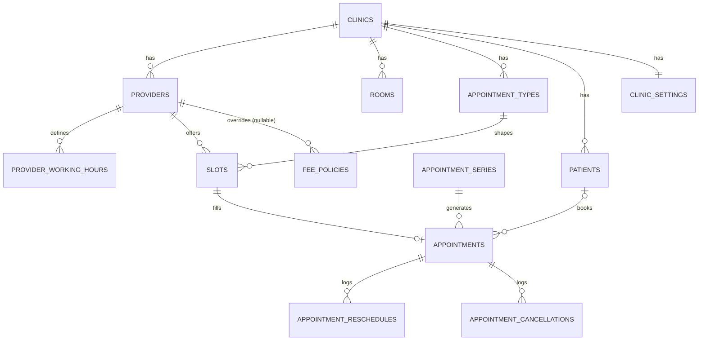
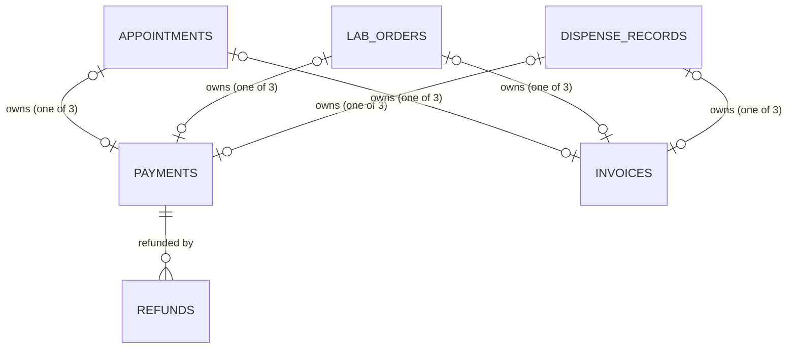

# Data Model

The database schema for clinic-management-saas, as it stands after all 29
Flyway migrations (`spring-boot-api/src/main/resources/db/migration/V1` through
`V29`). This document reflects the **current shape** of every table — several
tables were extended by later migrations after their original `CREATE TABLE`,
so a section below may combine columns from more than one migration file.

## Overview

**Tenancy.** `clinics.id` is the tenant key every tenant-scoped table carries
as its own `tenant_id` column — deliberately a separate UUID from
`clinics.keycloak_org_id`, so the app is never hard-wired to Keycloak's own id
format (see `TenantContextFilter`). Every tenant-scoped table in this schema
has a `tenant_id UUID NOT NULL REFERENCES clinics(id)` column and its own
`idx_<table>_tenant` index — this is true even for line-item tables that also
have a parent-row FK (`journal_lines`, `lab_order_tests`,
`purchase_order_lines`, `payroll_payments`), a deliberate denormalization so
every repository query can filter by tenant directly rather than joining up
to a parent first.

**Migrations.** 29 migrations, `V1__init.sql` through `V29__clinic_domain_column.sql`,
one per feature phase (see `CLAUDE.md` for the full phase-by-phase narrative).
Schema changes only ever happen via a new Flyway migration — `ddl-auto:
validate` means Hibernate checks the JPA entity mapping against the real
schema at startup and refuses to boot on a mismatch, it never auto-generates
DDL.

**Recurring shapes worth knowing before reading the sections below:**
- **Soft-deactivate via a `status` column**, not a boolean flag and not a row
  delete, is the default for anything referenced by FK with no cascade
  (`clinics`, `rooms`, `appointment_types`, `providers`, `medications`,
  `accounts`, `employees`, `inventory_items`, `suppliers`). A handful of
  tables are genuine hard-deletes instead, because they're pure configuration
  with a well-defined "missing" fallback: `fee_policies`, `lab_test_rates`,
  `drug_interaction_pairs`.
- **Append-only audit tables** — no `UPDATE`/`DELETE` path exists anywhere in
  the application code for these, even though the database doesn't enforce
  it: `appointment_cancellations`, `appointment_reschedules`, `consent_records`,
  `phi_access_log`, `encounter_addenda`, `refunds`, `journal_entries`/
  `journal_lines`, `dispense_records`, `stock_adjustments`,
  `asset_maintenance_records`.
- **"Exactly one owner" CHECK constraints** — a row belongs to exactly one of
  several possible nullable FK "owner" columns. Used repeatedly as this
  schema grew new owner types for an existing shared concept. See the
  **Billing & payments** section for the full list and how the constraint
  itself evolved from a 2-way `<>` to a 3-way `CASE`-sum as a third owner was
  added.
- **Line-item tables have no JPA relation to their parent** — `journal_lines`,
  `lab_order_tests`, `purchase_order_lines`, `payroll_payments` are each a
  plain table with a UUID FK column, queried explicitly by repository method,
  not mapped as a JPA `@OneToMany` collection.

---

## Core scheduling & tenancy tables

| Table | Key columns | Notes |
|---|---|---|
| `clinics` | `id` PK, `keycloak_org_id` UNIQUE, `name`, `status` (default `active`), `domain` (nullable, added V29), `created_at`, `updated_at` | The tenant row itself. |
| `clinic_settings` | `tenant_id` PK (1:1 with `clinics`), `tax_rate_percent`, `reschedule_fee_patient_portal`, `reschedule_fee_front_desk`, `reschedule_min_notice_hours`, `appointment_reminder_lead_hours`, `support_phone`, `support_email`, `address`, `website`, `logo_url`, `brand_color`, `accent_color`, `display_name`, `footer_note`, `timezone` (nullable, added V15), `updated_at` | A lazily-created singleton per tenant; every nullable field means "use the platform default." The tiered no-show/late-cancel fee is deliberately **not** here — see `fee_policies`. |
| `app_users` | `id` PK, `keycloak_user_id` UNIQUE, `tenant_id` (nullable — null for `patient`/`platform_admin` tokens), `display_name`, `email`, `created_at` | Local mirror of a Keycloak user, written once at first login; `tenant_id` is never consulted for authorization. |
| `patients` | `id` PK, `tenant_id`, `first_name`, `last_name`, `date_of_birth`, `phone`, `email`, `national_id`, `insurance_member_id`, `app_user_id` (nullable, added V2), `created_at` | Per-clinic scope — the same person seen at two clinics gets two separate rows, never linked. `UNIQUE(tenant_id, app_user_id)` where not null. |
| `providers` | `id` PK, `tenant_id`, `app_user_id` (nullable), `full_name`, `specialty`, `room_id`, `status`, `license_number`/`license_expiry`/`employment_status` (added V12), `signature_filename`/`signature_content_type` (added V12, bytes live on disk not in Postgres), `created_at` | |
| `provider_working_hours` | `id` PK, `tenant_id`, `provider_id`, `day_of_week` (`CHECK 0-6`, 0=Sunday), `start_time`, `end_time` | Recurring weekly availability; slot generation reads this. |
| `rooms` | `id` PK, `tenant_id`, `name`, `status` (added V4), `created_at` | |
| `appointment_types` | `id` PK, `tenant_id`, `name`, `duration_minutes`, `price_amount`, `status` (added V4), `created_at` | |
| `fee_policies` | `id` PK, `tenant_id`, `provider_id` (nullable — null = clinic-wide default), `cutoff_hours`, `fee_percent`, `created_at` | A **real hard delete** — no row means a 0% fee, not an error. |
| `slots` | `id` PK, `tenant_id`, `provider_id`, `appointment_type_id`, `start_time`, `end_time`, `status` (`open`/`booked`), `slot_class` (unused in v1, reserved), `created_at` | `UNIQUE(provider_id, appointment_type_id, start_time)` added V2, so slot generation is idempotent against double-insertion. |
| `appointments` | `id` PK, `tenant_id`, `slot_id`, `patient_id` (nullable — null for guest bookings), `provider_id`, `appointment_type_id`, `channel` (`patient_portal`/`front_desk`/`guest`), `status`, `appointment_ref` UNIQUE, `clinic_ref`, `customer_user_id` (nullable), `contact_name`/`contact_phone`/`contact_email` (guest-channel only), `idempotency_key`, `series_id`/`series_occurrence_index` (nullable, added V2), `booked_at`, `cancelled_at`, `cancellation_reason`, `created_at` | `UNIQUE(tenant_id, idempotency_key)`. `status` is free text driving the check-in state machine: `booked → checked_in → roomed → with_provider → checked_out`, or `no_show`/`cancelled`. |
| `appointment_series` | `id` PK, `tenant_id`, `patient_id`, `provider_id`, `appointment_type_id`, `channel`, `interval_weeks`, `occurrence_count`, `idempotency_key`, `created_at` | A bounded recurring-booking config; each occurrence is still its own real `appointments` row. |
| `appointment_reschedules` | `id` PK, `tenant_id`, `appointment_id`, `previous_slot_id`, `fee_amount`, `reason`, `created_by`, `created_at` | Append-only audit row per reschedule. |
| `appointment_cancellations` | `id` PK, `tenant_id`, `appointment_id`, `cancelled_by` (nullable — null for a patient self-cancel), `reason`, `fee_amount`, `cancelled_at` | Append-only audit row per cancellation. |

---

## Clinical / EHR tables

| Table | Key columns | Notes |
|---|---|---|
| `encounters` | `id` PK, `tenant_id`, `appointment_id` UNIQUE, `provider_id`, `chief_complaint`/`assessment`/`plan` (text), `icd10_codes` (free text, added V10), `signed_at`/`signed_by` (nullable, added V11), 18 physical-exam columns (added V21: `general_appearance_normal`/`_note`, `heent_normal`/`_note`, `cardiovascular_normal`/`_note`, `respiratory_normal`/`_note`, `abdominal_normal`/`_note`, `musculoskeletal_normal`/`_note`, `neurological_normal`/`_note`, `skin_normal`/`_note`, `psychiatric_normal`/`_note` — each a nullable boolean + a text note), `created_at`, `updated_at` | One per appointment. Once `signed_at` is set, the encounter and its prescriptions are locked — further changes go through `encounter_addenda`, never a direct edit. |
| `prescriptions` | `id` PK, `tenant_id`, `encounter_id`, `medication_name`, `dosage`, `instructions`, `route`/`frequency`/`duration`/`quantity_dispensed`/`refills_allowed`/`status` (added V10, `status` default `active`) | Free-text `medication_name` — a pharmacist later matches it by eye to a real catalog `Medication`, no FK between them. Full-replace on every save from `EncounterService`, never a merge. |
| `encounter_addenda` | `id` PK, `tenant_id`, `encounter_id`, `author_id`, `text`, `created_at` | Append-only; only creatable once the parent encounter is signed. |
| `allergies` | `id` PK, `tenant_id`, `patient_id`, `allergen`, `reaction_type`, `severity` (`mild`/`moderate`/`severe`), `status` (`active`/`resolved`/`unconfirmed`), `identified_at`, `recorded_by`, `created_at`, `updated_at` | Patient-level (not encounter-level), accumulates as a list — no delete, a correction is a new row + the old one marked `resolved`/`unconfirmed`. |
| `vitals` | `id` PK, `tenant_id`, `appointment_id` UNIQUE, `height_cm`, `weight_kg`, `temperature_c`, `pulse_bpm`, `respiratory_rate`, `blood_pressure_systolic`/`_diastolic`, `oxygen_saturation_pct`, `pain_score` (`CHECK 0-10`), `recorded_by`, `created_at`, `updated_at` | One per appointment, not tied to `encounters` — the one deliberate exception letting `front_desk` write clinical data, since this app has no separate nursing role. |
| `medical_history` | `patient_id` PK, `tenant_id`, `past_conditions`, `past_surgeries`, `current_medications`, `family_history`, `social_history`, `recorded_by`, `updated_at` | A singleton row per patient, full-replace on every save — not a versioned log. |
| `consent_records` | `id` PK, `tenant_id`, `patient_id`, `consent_type` (`general_treatment`/`privacy_data`), `policy_version`, `consent_given`, `witness_name`, `language_presented`, `data_sharing_preferences`, `signed_at`, `recorded_by`, `created_at` | Genuinely immutable once created; a patient can accumulate multiple rows of the same `consent_type` over time (e.g. re-consenting after a policy change). No signature image. |
| `immunizations` | `id` PK, `tenant_id`, `patient_id`, `vaccine_name`, `administered_at`, `dose_number`, `lot_number`, `site`, `appointment_id` (nullable, added V22), `recorded_by`, `created_at`, `updated_at` | Patient-level, accumulates as a list; no `status` column (each row is a discrete historical fact, nothing to resolve). `appointment_id` lets a visit summary show "immunizations given this visit." |
| `referrals` | `id` PK, `tenant_id`, `patient_id`, `encounter_id` (nullable), `referring_provider_id`, `receiving_provider_id` (nullable — set for internal, null for external), `external_provider_name`/`external_clinic_name`/`referred_to_specialty` (external only), `reason`, `clinical_summary`, `priority` (`routine`/`urgent`), `status` (`pending`/`accepted`/`scheduled`/`completed`/`declined`), `notes`, `created_at`, `completed_at` | One table for both internal and external referrals, distinguished by which nullable field group is populated. |

---

## Lab orders

| Table | Key columns | Notes |
|---|---|---|
| `lab_test_rates` | `id` PK, `tenant_id`, `test_code`, `base_charge`, `collection_fee`, `created_at`, `UNIQUE(tenant_id, test_code)` | A test only becomes orderable once this row exists — "config implies availability," same shape `fee_policies` uses. |
| `lab_orders` | `id` PK, `tenant_id`, `patient_id`, `encounter_id` (nullable), `ordering_provider_id` (nullable until confirmed), `customer_user_id` (nullable, set only for a patient-initiated request), `notes`, `priority`, `status` (`requested`/`ordered`/`specimen_collected`/`in_transit`/`resulted`/`reviewed`/`cancelled`), `order_ref` UNIQUE, `clinic_ref`, `total_cost` (snapshotted at order time), `ordered_at`, `specimen_collected_at`, `sent_at`, `resulted_at`/`resulted_by`, `reviewed_at`/`reviewed_by`, `cancelled_at`/`cancellation_reason`, `created_at` | |
| `lab_order_tests` | `id` PK, `tenant_id`, `lab_order_id`, `test_code` (nullable until confirmed), `test_name`, `specimen_type`, `notes`, `price` (snapshotted), `result_value`/`result_unit`/`reference_range`/`abnormal_flag`, `created_at` | Line items, own table, no JPA relation. |
| `lab_order_cancellations` | `id` PK, `tenant_id`, `lab_order_id`, `cancelled_by`, `reason`, `fee_amount`, `cancelled_at` | Mirrors `appointment_cancellations` exactly. |

---

## Billing & payments

| Table | Key columns | Notes |
|---|---|---|
| `invoices` | `id` PK, `tenant_id`, `appointment_id` (nullable UNIQUE), `lab_order_id` (nullable UNIQUE, added V15), `dispense_record_id` (nullable UNIQUE, added V27), `subtotal_amount`, `tax_amount`, `total_amount`, `created_at` | Immutable once issued — generating twice for the same owner 409s, enforced at the DB level too via each owner column's own UNIQUE. |
| `payments` | `id` PK, `tenant_id`, `appointment_id` (nullable), `lab_order_id` (nullable, added V5), `dispense_record_id` (nullable, added V27), `amount`, `method`, `transaction_id`, `invoice_id` (nullable, added V16), `gateway_transaction_id`/`gateway_status` (nullable, added V16), `recorded_by`, `created_at` | |
| `refunds` | `id` PK, `tenant_id`, `payment_id`, `amount`, `reason`, `gateway_refund_transaction_id`, `refunded_by`, `created_at` | Append-only; cumulative-refunded-so-far is enforced in `RefundService` (a running-sum check), not a plain CHECK. |

**The "exactly one owner" CHECK constraint** appears on three tables and evolved as new owner types were added:
- `payments`/`invoices` started with a simple `(appointment_id IS NOT NULL) <> (lab_order_id IS NOT NULL)` (V5/V15), then were rewritten in V27 to a 3-way `CASE`-sum (`... = 1`) once `dispense_record_id` was added — Postgres has no native 3-way XOR.
- `stock_batches` (V25) and `purchase_order_lines` (V25) each use the simple 2-way `<>` form, since they only ever have two possible owners (`medication_id`/`inventory_item_id`).

---

## Pharmacy

| Table | Key columns | Notes |
|---|---|---|
| `medications` | `id` PK, `tenant_id`, `name`, `form` (`tablet`/`capsule`/`syrup`/`injection`/`other`), `unit_of_measure`, `unit_price`, `reorder_threshold`, `status`, `controlled_substance_schedule` (nullable, added V24), `created_at` | The catalog — soft-deactivate only. |
| `stock_batches` | `id` PK, `tenant_id`, `medication_id` (nullable since V25), `inventory_item_id` (nullable, added V25), `batch_number`, `quantity_received`, `quantity_on_hand`, `expiry_date`, `received_at`, `status` (`active`/`depleted`/`expired`/`recalled`), `write_off_reason`, `created_at` | Originally pharmacy-only; generalized in V25 to also back general inventory items — see the exactly-one-owner CHECK above. No delete endpoint, real inventory/audit weight. |
| `dispense_records` | `id` PK, `tenant_id`, `prescription_id`, `medication_id`, `stock_batch_id`, `quantity_dispensed`, `safety_override_acknowledged` (added V23), `co_signed_by` (nullable, added V24 — set only for a controlled-substance dispense), `dispensed_by`, `notes`, `created_at` | Genuinely append-only, no `updated_at` at all. The pharmacist explicitly picks the batch — no automatic FEFO allocation. |
| `drug_interaction_pairs` | `id` PK, `tenant_id`, `medication_a_id`, `medication_b_id`, `severity` (`mild`/`moderate`/`severe`, nullable), `description`, `created_at` | Self-maintained — no licensed external drug-interaction database. A real hard delete. |
| `pending_controlled_substance_dispenses` | `id` PK, `tenant_id`, `prescription_id`, `medication_id`, `stock_batch_id`, `quantity`, `notes`, `safety_override_acknowledged`, `status` (`pending`/`cosigned`/`rejected`), `requested_by`/`requested_at`, `co_signed_by`/`co_signed_at`, `dispense_record_id` (set once cosigned), `rejected_by`/`rejected_at`/`rejection_reason`, `created_at` | The genuinely **mutable** workflow row — a two-person dual-sign-off gate before the matching `dispense_records` row (and real stock decrement) is created. |
| `prescription_refill_requests` | `id` PK, `tenant_id`, `prescription_id`, `patient_id`, `requested_by`, `notes`, `status` (`requested`/`approved`/`denied`), `reviewed_by`/`reviewed_at`/`review_notes`, `created_at` | Patient-initiated, staff-reviewed — same shape `lab_orders`' own request→confirm flow. |

---

## General inventory

| Table | Key columns | Notes |
|---|---|---|
| `inventory_items` | `id` PK, `tenant_id`, `name`, `category` (`clinical_supply`/`ppe`/`office_supply`), `unit_of_measure`, `unit_price`, `reorder_threshold`, `status`, `created_at` | The non-medication stock catalog; shares `stock_batches` with pharmacy. |
| `suppliers` | `id` PK, `tenant_id`, `name`, `contact_name`, `phone`, `email`, `status`, `created_at` | |
| `purchase_orders` | `id` PK, `tenant_id`, `supplier_id`, `status` (`ordered`/`received`/`cancelled`), `ordered_at`, `received_at`, `notes`, `created_at` | All-or-nothing receipt only — no partial-receiving granularity. |
| `purchase_order_lines` | `id` PK, `tenant_id`, `purchase_order_id`, `medication_id` (nullable), `inventory_item_id` (nullable), `quantity_ordered`, `unit_cost`, `created_at` | A line can order either a medication or a general item — same exactly-one-owner CHECK shape. No update/delete once created. |
| `stock_adjustments` | `id` PK, `tenant_id`, `stock_batch_id`, `quantity_delta` (signed), `reason` (`used`/`wasted`/`expired`/`correction`/`other`), `adjusted_by`, `notes`, `created_at` | Append-only; closes the gap non-medication stock has no `DispenseRecord`-equivalent driving its consumption. |
| `assets` | `id` PK, `tenant_id`, `name`, `serial_number`, `purchase_date`, `purchase_price`, `warranty_expiry`, `status` (`in_service`/`under_maintenance`/`retired`/`disposed`), `assigned_room_id` (nullable), `notes`, `created_at` | One row per physical item (not quantity-based), unlike every other inventory table here. |
| `asset_maintenance_records` | `id` PK, `tenant_id`, `asset_id`, `performed_at`, `description`, `performed_by`, `notes`, `created_at` | Append-only log; deliberately no `next_due_at`/reminder column — a history, not a second scheduling system. |

---

## Accounting & finance

| Table | Key columns | Notes |
|---|---|---|
| `accounts` | `id` PK, `tenant_id`, `code`, `name`, `type` (`asset`/`liability`/`equity`/`revenue`/`expense`), `status`, `created_at`, `UNIQUE(tenant_id, code)` | The chart of accounts. `code` is immutable after creation by convention (`JournalService` resolves seeded starter accounts by code) — not DB-enforced, same precedent as `lab_test_rates.test_code`. Lazily seeded with 4 starter accounts (Cash/Service Revenue/Refunds & Allowances/Salary Expense) the first time a tenant's accounting endpoints are touched. |
| `journal_entries` | `id` PK, `tenant_id`, `description`, `source_type` (`appointment_payment`/`lab_order_payment`/`refund`/`dispense_payment`/payroll), `source_id`, `posted_by`, `created_at` | Genuinely immutable — a mistake is corrected with a reversing entry, never an edit. |
| `journal_lines` | `id` PK, `tenant_id`, `journal_entry_id`, `account_id`, `amount` (`CHECK > 0`), `entry_type` (`debit`/`credit`), `created_at` | Line items, own table, no JPA relation — carries its own `tenant_id`. |
| `employees` | `id` PK, `tenant_id`, `app_user_id`, `full_name`, `email`, `salary_amount` (`CHECK > 0`), `status`, `created_at`, `UNIQUE(tenant_id, app_user_id)` | One row per staff `AppUser` opted into payroll — resolved by email at creation, name/email snapshotted. |
| `payroll_runs` | `id` PK, `tenant_id`, `year`, `month` (`CHECK 1-12`), `total_amount`, `run_by`, `created_at`, `UNIQUE(tenant_id, year, month)` | The unique constraint makes re-running an already-paid month a real 409, not a silent no-op. |
| `payroll_payments` | `id` PK, `tenant_id`, `payroll_run_id`, `employee_id`, `amount`, `journal_entry_id`, `created_at` | One row per employee per run, linking back to the specific balanced journal entry it caused. |
| `budgets` | `id` PK, `tenant_id`, `account_id`, `year`, `month` (`CHECK 1-12`), `amount`, `created_at`, `UNIQUE(tenant_id, account_id, year, month)` | Per-account, per-month target; references `accounts` directly — finance is built on top of accounting's ledger, not a parallel concept. |

---

## Platform, audit & notifications

| Table | Key columns | Notes |
|---|---|---|
| `phi_access_log` | `id` PK, `tenant_id`, `actor_user_id`, `actor_email`, `actor_role`, `patient_id` (nullable — null for a guest-channel resource with no `Patient` row), `resource_type`, `resource_id`, `action` (`read`/`write`), `endpoint`, `created_at` | Append-only, staff-initiated access only (never a patient viewing their own record). |
| `notifications` | `id` PK, `tenant_id`, `recipient`, `channel` (always `email` — SMS never built), `type`, `payload` (JSONB), `status` (`pending`/`sent`/`failed`), `attempts`, `created_at`, `sent_at` | Outbox pattern — written in the same transaction as the triggering event, dispatched asynchronously by `NotificationWorker` so a flaky email send never fails the triggering request. |

---

## Schema evolution

This document reflects the schema as of migration `V29`. The real,
authoritative source is `spring-boot-api/src/main/resources/db/migration/` —
every future feature adds a new `V<n>__description.sql` file there; this
document should be extended alongside it, not treated as a frozen snapshot.
