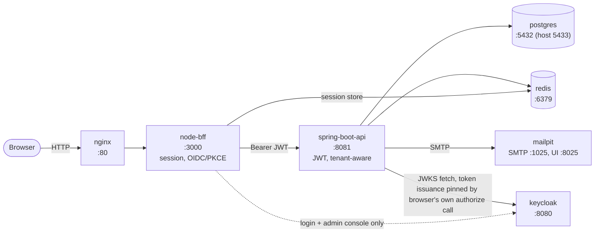

# Deployment Guide

This is the reference for how the system is actually composed and deployed
today — every service, its configuration, and the operational procedures
around it. For a step-by-step "get it running on your machine" walkthrough,
see [`setup-manual.md`](./setup-manual.md) instead; this document assumes
the stack is already up and answers "how is this put together, and how do I
operate it."

**Scope**: this project's only real deployment target today is a single
Docker Compose stack, meant for local development. There is no cloud
hosting, no secrets manager, no TLS termination, and no CI/CD deploy stage —
see [§7](#7-what-this-deployment-does-not-cover) for exactly what that means.

---

## 1. Architecture overview



The browser only ever talks to `nginx` and, through it, `node-bff`. It never
holds or sends a bearer token itself — only a session cookie. `node-bff` is
the *only* component that ever talks to Keycloak directly for an actual
login (the Authorization Code + PKCE flow); `spring-boot-api` only validates
already-issued JWTs against Keycloak's JWKS endpoint, it never participates
in a login.

---

## 2. Service topology

All seven services are defined in the single `docker-compose.yml` at the
repo root.

| Service | Image / build | Host port(s) | Container port(s) | Purpose |
|---|---|---|---|---|
| `postgres` | `postgres:16-alpine` | `5433` | `5432` | Primary datastore for both `clinic_management` and `keycloak` databases (one Postgres instance, two logical databases via `POSTGRES_MULTIPLE_DATABASES`, created by `infra/postgres/init-multiple-dbs.sh`). Remapped off the default host port 5432 — this dev machine also runs a native Windows PostgreSQL service occupying it; every container-to-container connection still uses `postgres:5432` internally, unaffected. |
| `redis` | `redis:7-alpine` | `6379` | `6379` | Two independent uses: node-bff's session store (`connect-redis`) and `spring-boot-api`'s `SlotLockService` (appointment-booking concurrency lock, `SETNX`+TTL). |
| `mailpit` | `axllent/mailpit:latest` | `8025` (web UI), `1025` (SMTP) | same | Local SMTP catcher standing in for a real email vendor — `SmtpEmailSender` delivers genuinely real SMTP mail here, just not to an external inbox (no SendGrid/Twilio account available for this project). |
| `keycloak` | `quay.io/keycloak/keycloak:26.0` | `8080` | `8080` | Identity provider — one realm (`clinic`), 7 realm roles, the Organizations feature for tenant grouping. Started with `start-dev --import-realm`, importing `infra/keycloak/realm-export.json` on boot. `KC_HOSTNAME_STRICT: "false"` so it reports back whichever host a request actually came in on (this is what makes the issuer-URL split in §3 necessary). Backed by the `keycloak` database inside the same `postgres` container. |
| `spring-boot-api` | built from `./spring-boot-api` | `8081` | `8081` | The tenant-aware JWT-validating API. Flyway-migrates the `clinic_management` database on boot (`ddl-auto: validate` — Hibernate never auto-DDLs). Waits on `postgres`/`redis` being *healthy* and `keycloak`/`mailpit` having *started* (its own healthcheck doesn't depend on Keycloak being ready — JWK-set resolution happens lazily on first request, not at startup). |
| `node-bff` | built from `./node-bff` | `3000` | `3000` | The only thing the browser talks to. Serves the built React SPA from its own `public/` directory, proxies `/api/*` to `spring-boot-api` with a Bearer header attached from the session, runs the OIDC flow. Waits on `spring-boot-api` being healthy; its own OIDC discovery retries with backoff (3s × 20 attempts, ~1 minute) to cover the gap between Keycloak's container starting and its realm import actually finishing. |
| `nginx` | `nginx:alpine` | `80` | `80` | Pure reverse proxy, zero business logic — single browser-facing entry point, routes everything to `node-bff`. Config mounted read-only from `infra/nginx/nginx.conf`. Waits on `node-bff` being healthy. |

Named volumes: `postgres_data` (database files, survives `docker compose
down` but not `down -v`), `uploads_data` (provider signature images and any
other `FileStorageService`-written files, local disk inside the container,
not S3/cloud — see `integration-architecture.md`).

---

## 3. Environment variables

`docker-compose.yml` bakes in a working default for every variable except
one (`BFF_CLIENT_SECRET`), so a `.env` file is optional in practice — copy
`.env.example` to `.env` to override anything. The variables that actually
matter:

| Variable | Used by | Default | Notes |
|---|---|---|---|
| `POSTGRES_USER` / `POSTGRES_PASSWORD` | postgres, keycloak, spring-boot-api | `clinicops` / `clinicops` | Shared across both logical databases. |
| `KEYCLOAK_ADMIN` / `KEYCLOAK_ADMIN_PASSWORD` | keycloak, spring-boot-api | `admin` / `admin` | spring-boot-api reuses these to call Keycloak's Admin REST API directly (`KeycloakOrganizationClient`/`KeycloakUserProvisioningClient`, used by `PlatformController`'s clinic-onboarding flow) — not the `keycloak-admin-client` library, a deliberate classpath-conflict avoidance. |
| `BFF_CLIENT_SECRET` | node-bff | `changeme-in-keycloak-console` (does **not** work as-is) | `realm-export.json` doesn't pin a secret for the confidential `clinic-bff` client, so Keycloak generates a random one on import. Must be fetched from the Admin Console (Clients → clinic-bff → Credentials) after first boot and placed in `.env`, then `node-bff` recreated. |
| `SESSION_SECRET` | node-bff | `changeme-long-random-string` | Any long random string; only needs to stay stable for as long as existing sessions should survive a restart. |
| `KEYCLOAK_ISSUER_URI` (spring-boot-api) / `KEYCLOAK_ISSUER` (node-bff) | both | `http://keycloak:8080/realms/clinic` | The **internal**, container-to-container issuer URL — used for the actual network calls (JWKS fetch, token endpoint, OIDC discovery). |
| `KEYCLOAK_ISSUER_PUBLIC_URI` (spring-boot-api) / `KEYCLOAK_ISSUER_PUBLIC` (node-bff) | both | `http://localhost:8080/realms/clinic` | The **public**, browser-reachable issuer URL. See the callout below — both services need this split for the same underlying reason. |
| `KEYCLOAK_ADMIN_BASE_URL` | spring-boot-api | `http://keycloak:8080` | Internal URL for the Admin REST API calls above. |
| `CLINICOPS_UPLOADS_ROOT` | spring-boot-api | `/app/uploads` | `FileStorageService`'s root — maps onto the `uploads_data` named volume. |
| `MAIL_HOST` / `MAIL_PORT` | spring-boot-api | `mailpit` / `1025` | `SmtpEmailSender`'s target. |
| `API_BASE_URL` | node-bff | `http://spring-boot-api:8081` | Internal URL node-bff proxies `/api/*` to. |
| `REDIS_URL` / `SPRING_DATA_REDIS_HOST`+`PORT` | node-bff / spring-boot-api | `redis://redis:6379` / `redis` + `6379` | Each service connects to Redis independently, for its own unrelated purpose (see §2). |
| `BFF_BASE_URL` | node-bff | `http://localhost:3000` | Used to build the OIDC `redirect_uri` (`${BFF_BASE_URL}/auth/callback`) — this is a known local-dev-only quirk: it points at node-bff's own host-mapped port directly rather than through nginx, so a login that happens to redirect through this path can land the browser on `localhost:3000` instead of `localhost:80`. Not fixed, since it's cosmetic only in dev. |

> **Why two issuer URLs, on both services?** Keycloak (with
> `KC_HOSTNAME_STRICT: "false"`) doesn't compute an `iss` claim per-request
> from each call's own Host header — it pins the issuer, for the *whole*
> authorization-code flow, to whichever host the **browser's own** original
> request to the authorize endpoint used, and stamps that same value into
> the resulting ID/access tokens — regardless of which host later makes the
> server-to-server token-exchange call. So every real token in this app
> carries `iss = KEYCLOAK_ISSUER_PUBLIC` (`localhost:8080`), never the
> internal `keycloak:8080` value, even though all the *network* calls
> (JWKS fetch, token endpoint, discovery) correctly stay on the internal,
> container-reachable host. `openid-client`'s ID-token validation (node-bff)
> and `NimbusJwtDecoder`'s issuer validator (spring-boot-api's
> `JwtDecoderConfig`) both have no opt-out for this check, so both had to
> split "where to fetch metadata/JWKS from" (internal) from "what `iss` to
> actually accept" (public) independently. See `node-bff/src/auth/oidc.js`
> for the full account of this — found and fixed live against a real
> Keycloak 26 login, not assumed from documentation.

---

## 4. Rebuilding and recreating a service

After changing a service's code:

```bash
docker compose up -d --build --force-recreate <service-name>
```

**The nginx-stale-IP gotcha**: nginx resolves a service's container IP once
and does not re-resolve it on a plain recreate. After recreating `node-bff`
specifically, every request through `:80` can keep 502ing even though the
new container is healthy and answers directly on `:3000` — fix with:

```bash
docker compose restart nginx
```

Verify any public/anonymous route change through `node-bff`'s own port (or
through nginx, once restarted) — never only via a direct `curl` to
`spring-boot-api:8081`, which bypasses both the BFF's session/proxy layer
and its `PUBLIC_ROUTES` allow-list entirely and will falsely "pass" even
when that allow-list is stale (`node-bff` must itself be rebuilt after
editing `PUBLIC_ROUTES` for a route change to take effect at all).

---

## 5. Database migrations

Schema changes happen exclusively through Flyway — `spring-boot-api`'s
`ddl-auto: validate` means Hibernate will refuse to start if the JPA entity
model and the actual schema disagree; it never auto-generates DDL.

- Migrations live in `spring-boot-api/src/main/resources/db/migration/`,
  named `V<n>__description.sql` (29 exist as of this session, `V1` through
  `V29`).
- A new migration is picked up automatically the next time `spring-boot-api`
  starts — Flyway runs before the Spring context (and therefore before
  Hibernate's schema validation) finishes initializing.
- To apply a freshly-added migration: rebuild and recreate the service
  (§4), then confirm via the container logs (`Migrating schema "public" to
  version "N - ..."` → `Successfully applied 1 migration`) or by querying
  `flyway_schema_history` directly against `localhost:5433`.
- Migrations are additive-only in practice across this project's history —
  no migration has ever dropped or destructively altered existing data; a
  schema correction is a new migration, not an edit to an already-applied
  one.

---

## 6. Keycloak realm setup

- `infra/keycloak/realm-export.json` is imported automatically on every
  `keycloak` container start (`start-dev --import-realm`) — this is what
  provisions the `clinic` realm, its 7 realm roles (`platform_admin`,
  `clinic_admin`, `provider`, `front_desk`, `patient`, `pharmacist`,
  `accountant`), the `clinic-bff` confidential client, and the demo user
  accounts (declared with their real roles, though without clinic
  Organization membership — that's a separate step, below).
- Keycloak's own **Organizations** feature groups clinic staff by tenant —
  a staff member's JWT carries an `organization` claim that
  `TenantContextFilter` resolves to a `clinics` row via
  `keycloak_org_id` (see `system-design.md` for the full tenancy model).
- `create-demo-clinic.sh` creates the demo clinic's Organization in
  Keycloak and adds every clinic-scoped demo user (`clinic_admin`,
  `provider`, `front_desk`, `pharmacist`, `accountant` — not `patient` or
  `platform_admin`, neither tied to a clinic) as a member of it. It's
  idempotent — re-running it looks up the existing Organization by alias
  instead of failing if it's already there, and reports each username as
  "already a member" rather than erroring if the membership already
  exists. There is no realm-export equivalent of this step; it has to be
  run once against a live Keycloak instance after `docker compose up`.

---

## 7. What this deployment does NOT cover

This project's deployment surface is, today, exactly what's described
above — a single-host Docker Compose stack intended for local development.
Specifically, none of the following exist in this repository:

- **No production cloud hosting** — no Kubernetes manifests, no cloud
  provider IaC (Terraform/CloudFormation/etc.), no managed-database or
  managed-Redis configuration.
- **No TLS termination** — nginx serves plain HTTP on `:80`; there's no
  certificate handling anywhere in `infra/nginx/nginx.conf`.
- **No secrets manager** — every credential above is a plain environment
  variable with a baked-in (often placeholder) default; there's no
  Vault/AWS Secrets Manager/equivalent integration.
- **No autoscaling or load balancing** — one instance of each service.
- **No CI/CD deploy stage** — `.github/workflows/ci.yml` runs three
  parallel test jobs (`mvn verify`, `npm test`, `npm run build`) on every
  push/PR; it does not build a deployable artifact or deploy anywhere.

If a production deployment is ever pursued, this document should be revised
to describe the real one, not extended with speculative infrastructure that
doesn't exist yet.
