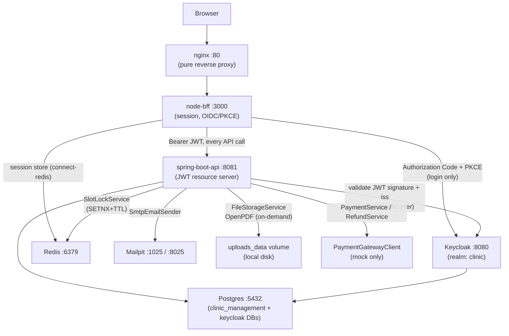

# Integration Architecture

How `clinic-management-saas` wires itself to every external and infrastructure
system it depends on. This is about *this* system's own specific choices, not
generic protocol explainers — each section pairs the "what" with the "why"
behind that particular wiring.

The stack is seven containers in `docker-compose.yml`: `postgres`, `redis`,
`mailpit`, `keycloak`, `spring-boot-api`, `node-bff`, `nginx`. Two of them
(`spring-boot-api`, `node-bff`) are this project's own code; the rest are
integrations.

## Summary diagram — who talks to whom



The deliberate boundary: **only `node-bff` ever talks to Keycloak to log
someone in.** `spring-boot-api` never performs an OIDC flow, never redirects
anyone, never sees a browser — it only validates bearer tokens that have
already been issued. The browser itself never holds a token at all, only an
HttpOnly session cookie against `node-bff`.

## 1. Keycloak (OIDC / OAuth2)

One realm, `clinic` (`infra/keycloak/realm-export.json`), with **seven realm
roles** — a 1:1 mapping onto this app's own roles, not a smaller set mapped
onto a larger one:

| Realm role | App role |
|---|---|
| `platform_admin` | Platform staff — onboards clinics |
| `clinic_admin` | Manages one clinic's providers, rooms, fee policies, settings |
| `provider` | Clinician — documents visits, orders labs |
| `front_desk` | Clinic counter staff — books/reschedules/checks in walk-ins |
| `patient` | Self-service patient, not tied to any one clinic |
| `pharmacist` | Medication catalog/stock, dispensing (added later) |
| `accountant` | Ledger, budgets, payroll — accounting + finance modules (added later) |

Keycloak's **Organizations** feature groups clinic staff by tenant — a staff
member's membership in an Organization is how `TenantContextFilter`
(`spring-boot-api`) resolves which clinic a request belongs to. The claim it
reads is configured via `clinicops.tenant.org-claim-path: organization`
(`application.yml`) — `patient`/`platform_admin` tokens carry no such claim at
all, since neither role is scoped to a single clinic.

**Who talks to Keycloak, and how:**

- `node-bff` runs the full Authorization Code + PKCE (S256) flow
  (`src/auth/oidc.js`) — this is the *only* component that ever redirects a
  browser to Keycloak's login page or exchanges a code for tokens.
- `spring-boot-api` never does an OIDC flow at all. It only validates
  already-issued bearer JWTs (`JwtDecoderConfig`) — fetching Keycloak's JWKS
  to check signatures, nothing else.
- `spring-boot-api`'s `PlatformController` (clinic onboarding, phase 6) is a
  third kind of caller: it talks to **Keycloak's Admin REST API** directly
  (`KeycloakOrganizationClient`, `KeycloakUserProvisioningClient`) using
  `RestClient` and the realm's own admin credentials — deliberately *not* the
  `keycloak-admin-client` library, to avoid its classpath-conflict risk. This
  is server-to-server administrative traffic, unrelated to the login flow
  above.

### The issuer-URL split (the one genuinely non-obvious wiring detail here)

Keycloak runs with `KC_HOSTNAME_STRICT: false`, so it reports whatever host a
request came in on. That creates a real split, confirmed live against a
running Keycloak 26:

> Keycloak pins the `iss` claim — for an entire authorization-code flow — to
> whichever host the **browser's own request to the authorize endpoint**
> used. It reuses that same value for both the RFC 9207 `iss` redirect
> parameter and the `iss` claim stamped into the resulting tokens,
> **regardless of which host later makes the token-exchange call**. Every
> token in this app's flows genuinely carries
> `iss = http://localhost:8080/realms/clinic` (the public URL the browser
> used), never `http://keycloak:8080/realms/clinic` (the internal,
> container-network URL `node-bff`'s own server-to-server calls use to reach
> Keycloak).

This single fact forces an identical split in two independent places:

**`node-bff` (`src/auth/oidc.js`, `buildOidcClient`)** — OIDC discovery runs
against the internal URL (`KEYCLOAK_ISSUER`, reachable from inside the
container), which returns metadata with internal-host endpoints. Before
building the client, three fields get rewritten to the public host
(`KEYCLOAK_ISSUER_PUBLIC`):
- `authorization_endpoint` and `end_session_endpoint` — redirect targets
  handed to the browser, which can't resolve the hostname `keycloak`.
- `issuer` itself — because `openid-client`'s mandatory ID-token validation
  checks this field against the token's real `iss` claim, and that claim is
  the public value per the finding above. (`token_endpoint`/`jwks_uri` are
  **not** rewritten — those drive real network calls `node-bff` itself makes
  server-to-server, and stay on the internal, reachable host.)

**`spring-boot-api` (`JwtDecoderConfig`)** — Spring Boot's default
autoconfiguration (a single `issuer-uri` property feeding
`JwtDecoders.fromIssuerLocation(...)`) can't express this split at all, since
it couples "where to fetch the JWKS from" and "what `iss` to accept" into one
string. The decoder is built by hand instead:

```java
NimbusJwtDecoder.withJwkSetUri(internalIssuerUri + "/protocol/openid-connect/certs")
// ...
decoder.setJwtValidator(JwtValidators.createDefaultWithIssuer(publicIssuer));
```

— JWKS fetched from `clinicops.keycloak.internal-issuer-uri`
(`KEYCLOAK_ISSUER_URI`, internal), `iss` validated against
`clinicops.keycloak.public-issuer` (`KEYCLOAK_ISSUER_PUBLIC_URI`, public).
Guarded with `@Profile("!test")` so integration tests use their own
no-network-call test decoder instead.

A tempting alternative — giving Keycloak a single fixed `KC_HOSTNAME` so the
issuer is host-independent everywhere — was tried once and reverted: it fixes
the issuer, but also makes Keycloak render its own *in-page login form*
actions off that fixed (internal-only) hostname, breaking browser
reachability of the login page itself.

**Environment variables** (`docker-compose.yml`):

| Variable | Service | Value | Used for |
|---|---|---|---|
| `KEYCLOAK_ISSUER` | node-bff | `http://keycloak:8080/realms/clinic` | OIDC discovery, token/userinfo calls |
| `KEYCLOAK_ISSUER_PUBLIC` | node-bff | `http://localhost:8080/realms/clinic` | authorize/end-session redirects, `issuer` validation |
| `KEYCLOAK_ISSUER_URI` | spring-boot-api | `http://keycloak:8080/realms/clinic` | JWKS fetch |
| `KEYCLOAK_ISSUER_PUBLIC_URI` | spring-boot-api | `http://localhost:8080/realms/clinic` | `iss` claim validation |
| `KEYCLOAK_ADMIN_BASE_URL` | spring-boot-api | `http://keycloak:8080` | Admin REST API (clinic onboarding only) |

## 2. Postgres

Primary datastore for business data — and, in this stack, nothing else:
sessions live in Redis, not here (see §3). Two logical databases share the
one container: `clinic_management` (this app's own schema) and `keycloak`
(Keycloak's own internal state), provisioned by
`infra/postgres/init-multiple-dbs.sh` from the single `POSTGRES_MULTIPLE_DATABASES`
variable.

Schema is entirely Flyway-managed — 29 migrations as of this session
(`spring-boot-api/src/main/resources/db/migration/V1__init.sql` through
`V29__clinic_domain_column.sql`), with Hibernate's own `ddl-auto: validate`
making sure the JPA entity model and the actual migrated schema never drift
apart silently.

Container-to-container traffic always uses `postgres:5432` on the Docker
network — unaffected by the one host-side quirk: this project's dev machine
also runs a native Windows `postgresql-x64-17` service permanently holding
port 5432, so `docker-compose.yml` publishes the container's port as
**`5433`** on the host (`"5433:5432"`). Only a host tool connecting from
*outside* Docker (`psql`, a GUI client) needs `localhost:5433` — nothing
inside the compose network is affected.

## 3. Redis

Two independent, unrelated uses of the same Redis instance:

**(a) `node-bff`'s session store**, via `connect-redis`. The BFF is stateless
across restarts/horizontal scale — a signed-in user's session (and the OAuth
token set inside it) survives a `node-bff` container recreate because it
never lived in that container's own memory. The token set round-trips through
Redis as plain JSON; `node-bff` has to rewrap it via `new TokenSet(...)`
before calling any `openid-client` method that expects the real class
instance, since JSON round-tripping loses that.

**(b) `SlotLockService`** (`spring-boot-api`) — a short-lived,
per-appointment-slot lock so two concurrent booking attempts (a patient in
the portal, front-desk at the counter) for the same slot can never both
succeed. Implementation is a Redis `SETNX`-with-TTL
(`StringRedisTemplate.opsForValue().setIfAbsent(key, lockToken, ttl)`), with
release done via a small Lua script that only deletes the key if it still
holds *this* request's own random token — so a slow request can never delete
a lock that already expired and was re-acquired by someone else. This is a
line-for-line port of the same pattern the project's own predecessor
(bus-ticketing-saas) established first for seat-locking.

These two uses are completely independent — the same Redis instance just
happens to serve both, with no shared keyspace or coupling between them.

## 4. nginx

A pure reverse proxy, the single browser-facing entry point on `:80`, with
zero business logic of its own — every request it receives is forwarded to
`node-bff`. `spring-boot-api` is never reachable from outside the Docker
network at all in this topology (its `:8081` is published for local
debugging only, per `docker-compose.yml`'s own comment, not for real traffic).

**Operational gotcha, worth knowing before it bites you**: nginx resolves a
proxied service's container IP once, at config load / first connection, and
does **not** re-resolve it on a plain `docker compose up -d --build
--force-recreate node-bff`. The result is nginx confidently 502-ing every
request against a stale IP, even though the new `node-bff` container is
healthy and answers directly on `:3000`. Fix: `docker compose restart nginx`
immediately after recreating `node-bff`. Always verify a change through
`http://localhost/` (nginx), not just `:3000` directly — the latter will
pass even when the public-facing route is actually broken.

## 5. Mailpit

A local, open-source SMTP catcher standing in for a real transactional-email
vendor — no SendGrid/Twilio account exists for this project. The
distinction that matters: `SmtpEmailSender` performs **genuine SMTP
delivery** with real per-notification-type rendered subjects/bodies; it's
only the *destination* that's local (Mailpit's web UI, `:8025`, instead of a
real inbox), not the delivery mechanism itself. `spring-boot-api` talks to
Mailpit's SMTP listener on `:1025` (`MAIL_HOST`/`MAIL_PORT`).

Real notification types that flow through it today
(`com.clinicops.notification`, one payload record + one `SmtpEmailSender`
`case` per type):

| Type | Payload | Triggered by |
|---|---|---|
| `appointment_confirmed` | `AppointmentConfirmedPayload` | A booking completes |
| `appointment_cancelled` | `AppointmentCancelledPayload` | A cancellation (staff or patient self-service) |
| `appointment_rescheduled` | `AppointmentRescheduledPayload` | A reschedule completes |
| `lab_result_ready` | `LabResultReadyPayload` | A lab order's results are entered |
| `refill_ready` | `RefillReadyPayload` | A pharmacist approves a prescription refill request |

Two things *not* covered, by deliberate scope boundary rather than oversight:
**SMS is entirely unbuilt** — `Notification.channel` never becomes anything
but `"email"`, pending a real Twilio account; and the one-time **temporary
password** generated when a platform_admin provisions a new clinic's initial
`clinic_admin` login is **never emailed** — it's returned once, directly in
the API response, and has to be handed over out of band (there's no real
inbox at the other end to safely send a credential to in local dev).

## 6. Payment gateway

`com.clinicops.paymentgateway.PaymentGatewayClient` is the seam a real
payment vendor integration slots into later — today, `MockPaymentGatewayClient`
is the only implementation (no real vendor or credentials wired up; a
deliberate, explicitly pinned scope decision, not a placeholder left by
accident).

```java
public interface PaymentGatewayClient {
    ChargeResult charge(BigDecimal amount, String method);
    RefundResult refund(String gatewayTransactionId, BigDecimal amount);
}

public record ChargeResult(String transactionId, String status);   // status: pending | succeeded | failed
public record RefundResult(String refundTransactionId, String status);
```

The mock always fast-paths straight to `succeeded`, but every caller is
already written against the general `pending`/`succeeded`/`failed` shape —
a real gateway that confirms a charge asynchronously via webhook (genuinely
`pending` at first) is a new implementation of this same interface, not a
redesign of anything that calls it.

Real call sites: **`PaymentService`** and **`RefundService`** — shared
services behind every payment-recording endpoint in the app
(`AppointmentPaymentController`, `LabOrderPaymentController`, and the
dispense-billing endpoints added for pharmacy sales), so every payment
channel in this app already routes through the same gateway seam uniformly,
regardless of which domain object (appointment, lab order, dispense record)
it's attached to.

## 7. File storage

Local disk + a **named Docker volume** (`uploads_data`), not S3 or any cloud
object store — a decision made ahead of need and documented as such, so a
future move to cloud storage is a deliberate later call, not an accident of
how this was first built.

`com.clinicops.filestorage.FileStorageService` is the one write/read seam:
one file per `(subdirectory, ownerId)` pair, named `<ownerId><extension>`
— never the caller-supplied original filename, specifically to avoid path
traversal or an unexpected extension ever reaching disk. A later `store()`
call for the same owner overwrites (current file only, no version history —
the same convention `MedicalHistory`/`Vitals` already use for their own
singleton-per-owner rows). Mounted at `/app/uploads` in the container
(`CLINICOPS_UPLOADS_ROOT`), backed by the `uploads_data` volume so an
uploaded file survives a `spring-boot-api` container recreate. Today's one
real consumer: provider digital-signature uploads.

**PDF generation** (OpenPDF) is a related but separate concern — invoices
and visit-summary documents are rendered **on demand, every time**, and
never written to disk at all; regenerating from the already-persisted
source data (an `Invoice` row, an appointment's own clinical records) costs
nothing, so there's nothing to cache or invalidate.

---

*Written as part of the 2026-10 documentation pass — deployment guide, setup
manual, user guide, system design, component architecture, coding-layers
guide, data model, and API reference are its siblings under `docs/`.*
