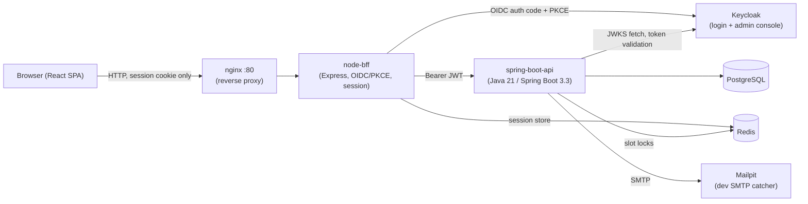

# System Design

## 1. System overview

clinic-management-saas is a multi-tenant clinic management SaaS. Tenants are **clinics** — each
clinic manages its own providers, rooms, appointment calendar, patients, and staff, fully
isolated from every other clinic on the platform. Built out incrementally across roughly 39
phases, the product has grown from a booking/scheduling kickoff spec into a fairly complete
clinical, pharmacy, inventory, and accounting/finance platform:

- Patient booking and front-desk scheduling, with a full check-in state machine
- A growing electronic health record: encounters, vitals, allergies, immunizations, medical
  history, consent, prescriptions, referrals, physical-exam findings, visit summaries
- A pharmacy module: medication catalog, batch-tracked stock, dispensing, controlled-substance
  dual-sign-off, drug-interaction checks, patient refill requests
- A general inventory module (clinical supplies, PPE, office supplies, equipment/assets) separate
  from pharmacy stock
- Accounting (chart of accounts, double-entry journal) and finance (payroll, budgets, P&L)
- Platform-admin clinic onboarding, billing/invoicing, and a clinic-admin analytics dashboard

See `CLAUDE.md` at the repo root for the full, dated, phase-by-phase history of *why* each piece
exists — this document only covers the resulting shape.

## 2. Architecture

The browser never holds an access or refresh token — only an httpOnly session cookie. `node-bff`
is the only thing the browser ever talks to; it owns the OAuth2 Authorization Code + PKCE (S256)
flow against Keycloak, keeps the resulting token set in a Redis-backed server session, and forwards
API calls to `spring-boot-api` with a Bearer header attached server-side. `spring-boot-api` is
fully stateless — it validates the bearer JWT on every request and never talks to the browser
directly. See `component-architecture.md` for how each of these pieces is built internally.

## 3. Multi-tenancy model

- `clinics.id` (internally `tenant_id` wherever it's referenced from another table) is the
  platform's own tenant key — deliberately **not** the same value as `clinics.keycloak_org_id`,
  so the application is never hard-wired to Keycloak's own id format.
- There is **no** blanket Hibernate multi-tenant filter. Instead:
  - `TenantContextFilter` runs once per request, after JWT authentication. It reads the
    `organization` claim off a staff token, resolves it to a `clinics.id` via
    `ClinicRepository.findByKeycloakOrgId`, and stashes it in a request-scoped `TenantContext`
    (a plain `ThreadLocal`). It is also the clinic-deactivation enforcement point: if the
    resolved clinic's `status != "active"`, the filter short-circuits with a `403` and the
    request never reaches a controller.
  - Every staff-scoped repository method takes the tenant id **explicitly** as a parameter
    (e.g. `findByTenantIdAndId(...)`, `findAllByTenantId(...)`) — never an implicit read of
    `TenantContext` deep inside a shared base repository. This keeps it obvious, from a method
    signature alone, whether a query is tenant-scoped or cross-tenant.
  - `TenantContext` is empty (`null`) for `patient` tokens (patients are never members of a
    Keycloak Organization) and for `platform_admin` tokens (which act across every tenant by
    design). Code that genuinely needs a tenant calls `TenantContext.require()`, which throws
    a clear `IllegalStateException` rather than silently proceeding with a null tenant.
  - Every `/api/**` endpoint carries an explicit `@PreAuthorize` role check (`@EnableMethodSecurity`
    is turned on deliberately — Spring Security 6 does not enable it by default), except the
    handful of endpoints that are genuinely public (e.g. clinic directory lookup, slot
    availability, appointment/lab-order tracking by reference).
  - A mirror `tenant_id` is written once on a local `app_users` row at provisioning time, but is
    **never consulted for authorization** — the per-request token is always the source of truth.
- `TenantIsolationIntegrationTest` is a dedicated regression suite: for every staff-scoped
  resource, one tenant seeds data and a different tenant's staff are confirmed unable to read or
  write it (expecting `404`, never a leaking `403`).

## 4. Roles

| Role | Scope |
|---|---|
| `patient` | Self-service: book/view/cancel/reschedule own appointments, request lab tests, view own prescriptions/refill requests, download own visit summaries. No organization membership — always cross-tenant by nature, scoped to their own data by ownership, not tenant. |
| `front_desk` | Walk-in patient registration/search, booking on a patient's behalf, the check-in state machine, payments, and (since the module expansion) general inventory management. |
| `provider` | Clinical documentation: encounters, prescriptions, referrals, lab orders, vitals/allergies/immunizations, exam findings, sign-and-lock. Reads/writes only within their own clinic. |
| `clinic_admin` | Full administrative control of one clinic: provider/room/appointment-type/fee-policy/lab-rate CRUD, branding/settings, and an override (full access, no ownership check) into every other staff role's own module (pharmacy, accounting/finance, inventory). |
| `pharmacist` | Medication catalog, stock batches, dispensing (including the controlled-substance dual-sign-off workflow), drug-interaction pairs, the patient refill-request review queue. |
| `accountant` | Chart of accounts, the double-entry journal, payroll, budgets, P&L/budget-vs-actual reporting. |
| `platform_admin` | Cross-tenant: onboards new clinics (creates the Keycloak Organization + local `clinics` row, optionally an initial `clinic_admin` login), deactivates/reactivates clinics. Never scoped to one tenant. |

## 5. Evolution in phases (condensed)

The system was built sequentially, almost always with direct scoping questions put to the user
before a new module was designed — see `CLAUDE.md` for the full, dated write-up of every decision.
In shape:

1. **Phases 1–7** — the original kickoff spec: infra/auth skeleton, patient booking flow,
   front-desk/check-in, provider clinical flow, clinic-admin config, platform-admin onboarding,
   lab orders.
2. **Phases 8–15** — an EHR-leaning expansion: allergies, vitals, medical history, consent,
   prescription/coding depth, sign-and-lock clinical notes, provider profile hardening
   (license/signature), referrals, real billing.
3. **Phases 16–19** — infrastructure depth: a real (mock-vendor) payment gateway + refunds +
   invoice PDFs, real SMTP email delivery, per-clinic timezone, a clinic-admin analytics
   dashboard.
4. **Phases 20–22** — a new module set: pharmacy (catalog/stock/dispensing), accounting
   (chart of accounts/journal), finance (payroll/budgets/reporting).
5. **Phases 23–26** — recurring-series cancellation, then a "full-EHR-breadth" backlog:
   immunizations, structured physical-exam findings, a visit/encounter summary PDF (including
   this app's first patient-facing document download).
6. **Phases 27–34** — a ten-phase pharmacy expansion + a new general stock/inventory module:
   clinical safety checks, controlled-substance tracking, the inventory foundation, equipment/
   asset tracking, pharmacy billing integration, smarter dispensing, patient-facing pharmacy
   features, unified reporting.
7. **Phases 35–39** — a frontend gap-closing pass, giving every backend module built without a
   dedicated UI (general inventory, drug-interaction pairs, dispense billing, controlled
   substances, patient prescriptions/refills) a real frontend — closing out every role/API
   combination in the app.

Two later, non-numbered passes (2026-10-01/02) re-audited the entire frontend for UI consistency
and for search/filter coverage across every page, fixing what each audit found.

## 6. Non-functional characteristics

**Real, built, and live-verified:**
- PHI access audit logging (`com.clinicops.phiaudit`) — staff-initiated access to
  patient/encounter/prescription/lab-order data is logged, reviewable by `clinic_admin`.
- Full i18n: English + Amharic, a complete UI sweep (~1000 translation keys, parity-checked).
- Light/Dark/System theming, with a validated chart color palette for CVD-safe, dark-mode-safe
  analytics.
- Per-clinic timezone, consumed by slot generation and every day/month-boundary computation.
- A real (mock-vendor) payment gateway abstraction with full/partial refunds and on-demand
  invoice PDFs.

**Explicitly not built yet** (see `deployment-guide.md` and `CLAUDE.md`'s "Known gaps" section):
- A real external payment gateway vendor (Stripe/etc.) — the `PaymentGatewayClient` interface
  exists, only a mock implementation is wired in.
- SMS notifications — `Notification.channel` never resolves to anything but `"email"`.
- Any production hosting target — this project today only runs via local `docker compose`; there
  is no cloud deployment, secrets manager, or CD pipeline.
- Real-code drug-interaction/ICD-10 datasets — both are deliberately minimal (a self-maintained
  interaction-pairs table, free-text ICD-10) rather than licensed medical code sets.

## 7. Key architectural decisions

These are the decisions most worth understanding before changing anything structural. Each is
explained in depth in `component-architecture.md` (the "how") or `coding-conventions.md` (the
day-to-day pattern it produces):

- **No Hibernate multi-tenant filter.** A deliberate choice (see §3) — tenant scoping is always
  explicit in a method signature, never implicit "magic" that could silently leak across tenants
  if ever misconfigured.
- **The BFF (Backend-for-Frontend) pattern.** `node-bff` exists specifically so the browser never
  holds a real access or refresh token — only a session cookie. This closes off an entire class of
  token-theft/XSS-exfiltration risk that a SPA talking directly to an OAuth2 API would carry.
- **Flyway-only schema changes.** `spring-boot-api` runs with `ddl-auto: validate` — Hibernate
  never creates or alters a table. Every schema change is a new, numbered, checked-in
  `V<n>__description.sql` migration (currently at `V29`). See `deployment-guide.md` for how this
  plays out at container startup.
- **No cross-tenant marketplace search.** A patient picks a clinic first, then browses that one
  clinic's own data — there is no shared cross-clinic search dimension (unlike, say, a
  bus-ticketing search by route), since each clinic defines its own appointment types/services
  independently.
- **Split-bean writers for genuinely contended resources only.** `AppointmentWriter`,
  `AppUserWriter`, `PatientWriter` exist because their callers need `@Transactional`
  self-invocation or Redis-lock coordination (`SlotLockService`); everything else (the vast
  majority of this codebase) is a controller calling a repository directly, with no speculative
  service-layer indirection.
